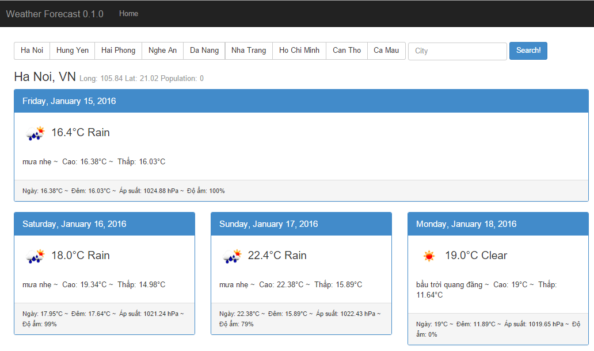

#### Note: Fix in latest update (v 0.1.6) on October 30, 2015
Fixed bug leading to broken openweathermap API calls: Header field `x-api-key`
is not sufficient anymore, so that now an additional query parameter `APPID` is mandatory.

---

# a weather forecast app written in AngularJS



"OpenWeather App" is a small AngularJS project that makes use of the [OpenWeatherMap](http://openweathermap.org/)
service for fetching and displaying weather data and forecasts based on a given location (city).


## Demo

A demo site running this little app can be found [here](https://vunb.herokuapp.com/weather/app/).


## Why?

Points of interests:

* Building an app with AngularJS (of course!)
* Building an app based on the [OpenWeatherMap API](http://openweathermap.org/API/)
* Bootstrapping an AngularJS app: Basic modules and view definition, ng-app, ng-view
* Defining a controller for handling the weather data in $scope
* Defining a service for fetching weather data from openweathermap.com via JSONP
* Defining a custom directive for instantly embedding sort of "weather data day panel"

angular-openweather-app uses:

* [AngularJS v1.2.0-rc.2](https://github.com/angular/angular.js) / [angular-seed](https://github.com/angular/angular-seed)
* [iso-3166-country-codes-angular](https://github.com/BluePyth/iso-3166-country-codes-angular)
* [Bootstrap v3.0.0](https://github.com/twbs/bootstrap)


## Installation

### Clone repository and install dependencies

via git and npm:

```
$ git clone git@github.com:Vunb/demo.git [my-app-name]
$ cd [my-app-name]
$ npm install
```

## License

[The MIT License](http://opensource.org/licenses/MIT)

All data provided by the great service and API of [OpenWeatherMap](http://openweathermap.org/).

Copyright (c) 2013 Matthias Lienau &lt;matthias@mlienau.de&gt;
